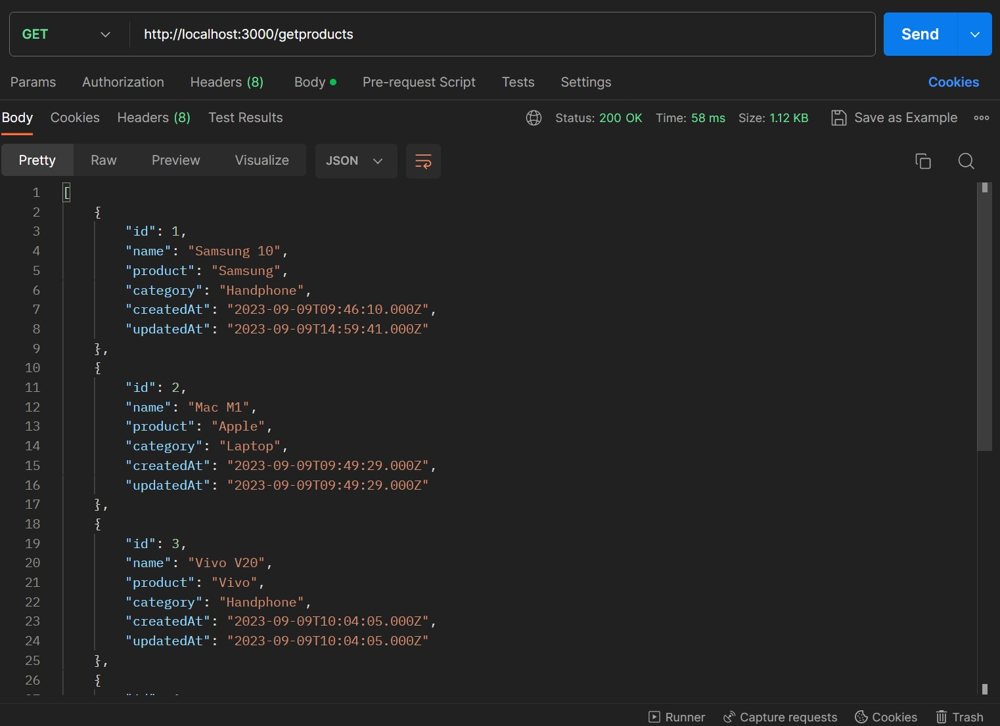
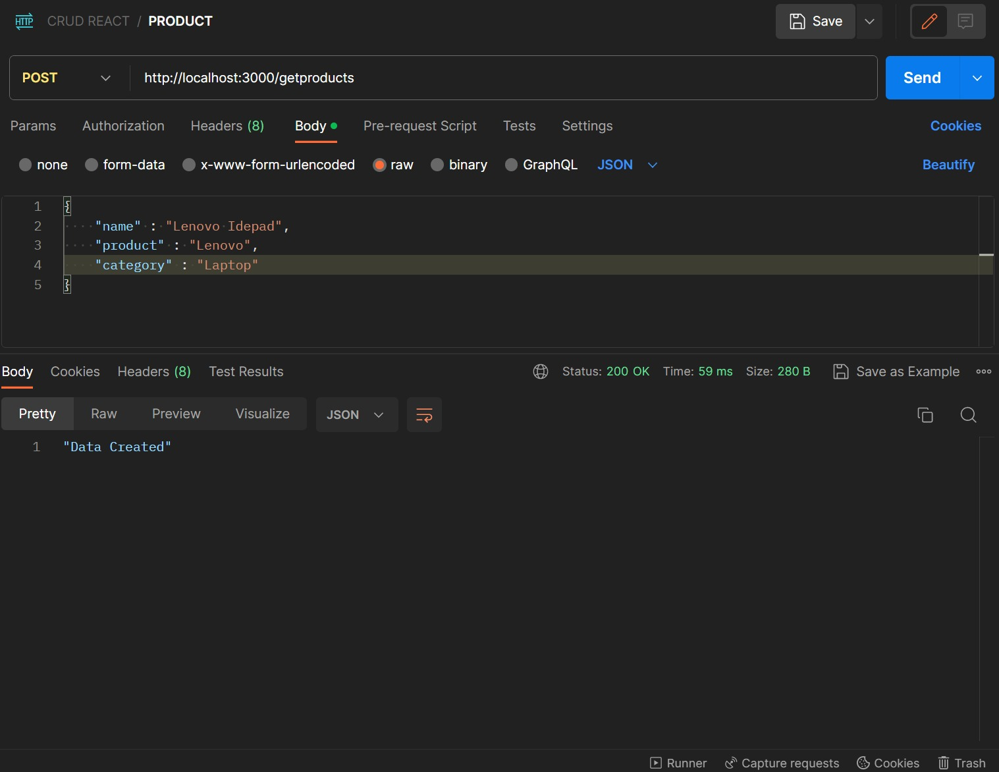
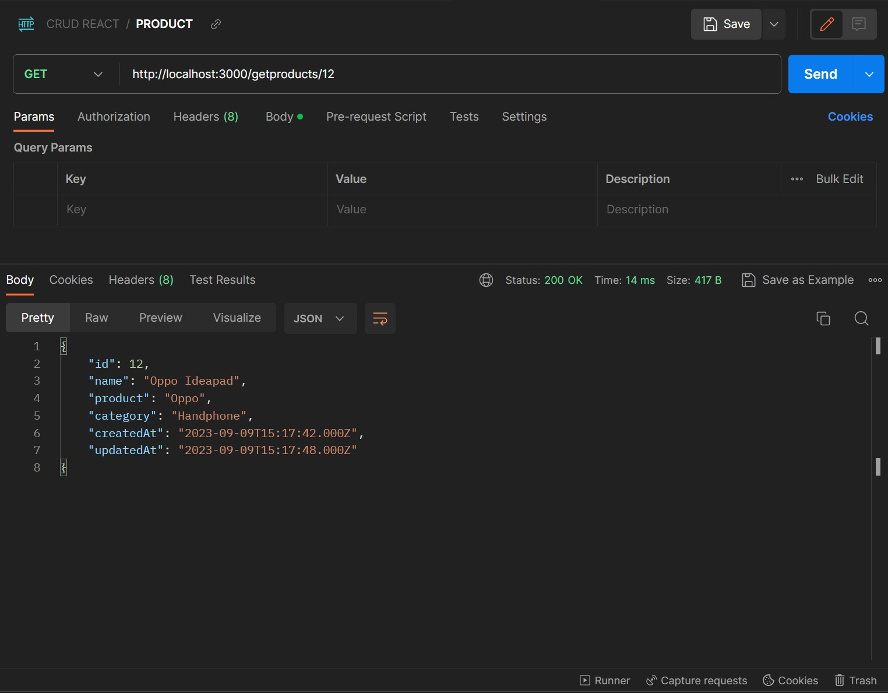
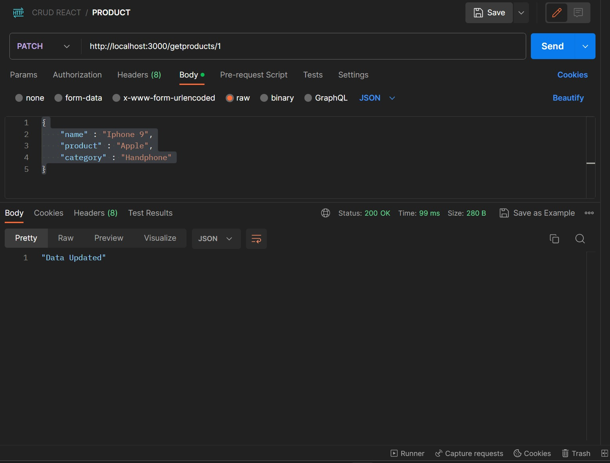
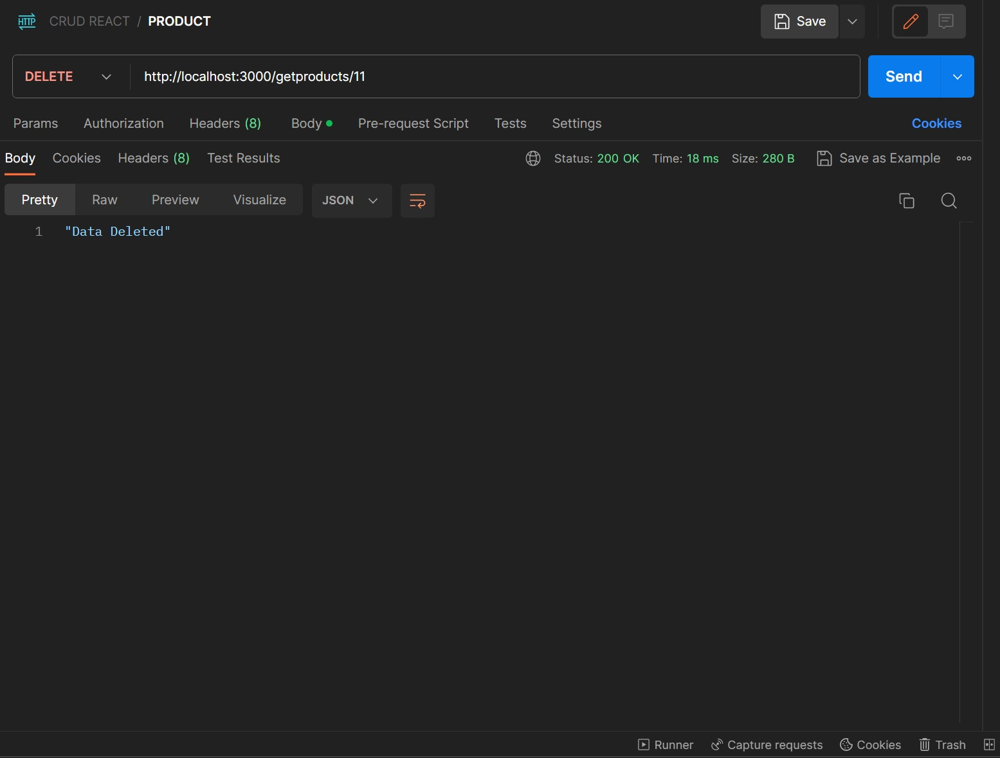

# Backend Project CRUD React with Node JS, Express, and MySQL  

This project was generated with :   
~ NodeJs version 16.14.0  
~ Express version 4.18.2  
~ MySQL version 3.6.0  
~ Sequelize version 6.33.0 

## Development Project
1. Run Module Apache and MySql in the xampp application
2. Then import the `crud_react` database in phpmyadmin
3. Open a terminal on the project in Visual Studio Code
4. First run `npm start` to start the backend

## Check the data in Postman App (API)
1. GET http://localhost:3000/getproducts to check all data pruduct
2. GET http://localhost:3000/getproducts/12 to check data By ID
3. POST http://localhost:3000/getproducts to add data via postman use Body (JSON) in postman, example data :
`{
    "name" : "Iphone 9",
    "product" : "Apple",
    "category" : "Handphone"
}`
4.  PATCH http://localhost:3000/getproducts/1 to updated data ID 1 use Body (JSON) in postman, example data :
`{
    "name" : "Samsung 10A",
    "product" : "Samsung",
    "category" : "Handphone"
}`
5. DELETE http://localhost:3000/getproducts/11 to delete data ID 11

## Get All Data Product
This is the page view for all product data in table `p_product`.

 

----

## Post Add Data Product
This is the page display when you have successfully added new product data to the `p_product` table using body json.

 

----

## Get Data By ID
This is the page display when you want to see data based on the selected ID.

 

----

## Patch Update Data Product
The patch functions to update data in the product table which can later be updated based on the Body Json.

 

---

## Delete Data Product
When you want to delete data on Postman, just enter the ID you want to delete, then the data you choose will be automatically deleted.

