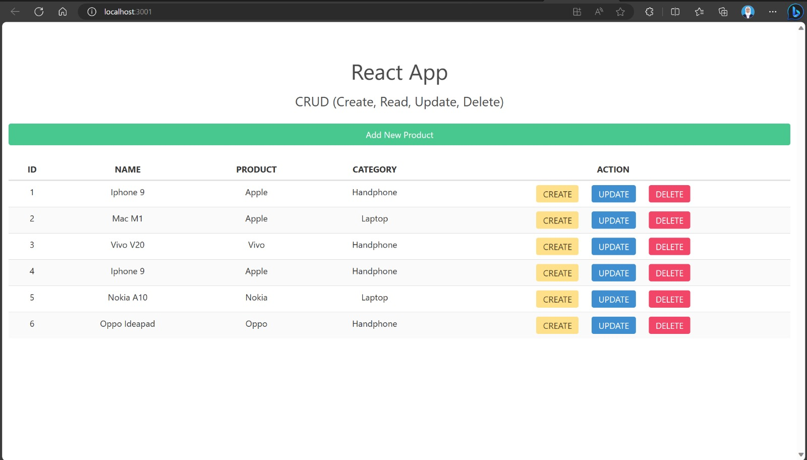
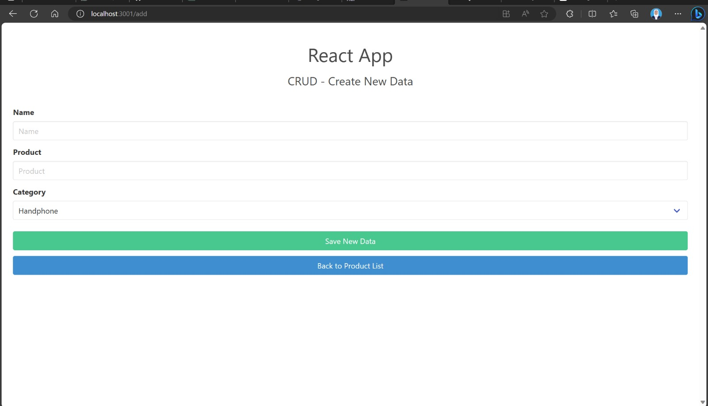
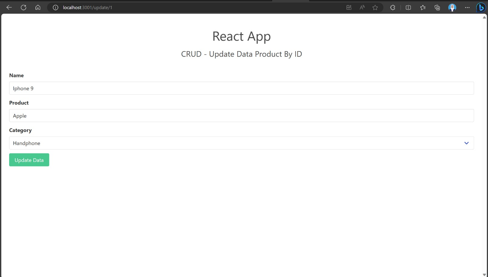
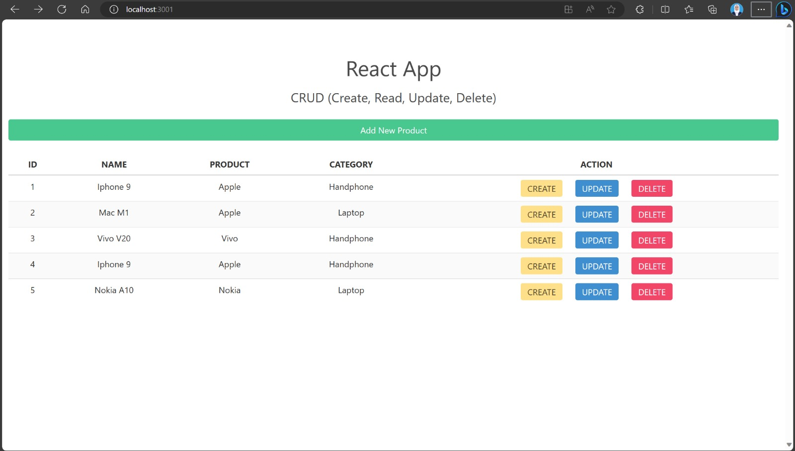

# Frontend Project CRUD with React, Bulma Css, Axios

This project was generated with :   
~ React, React-Dom version 18.2.0  
~ React-Router-Dom version 6.15.0  
~ Bulma Css version 0.9.4  
~ Axios version 1.5.0 

## Development 
1. The first run `npm start` to start backend.
2. Then run `npm start` to start frontend. 
3. Navigate to `http://localhost:3001/`.  
The application will automatically reload if you change any of the source files.

## Build Project
Run `npm run build`. Builds the app for production to the `build` folder.
It correctly bundles React in production mode and optimizes the build for the best performance.

The build is minified and the filenames include the hashes.\
Your app is ready to be deployed!

## Learn More about React
To learn React, check out the [React documentation](https://reactjs.org/).

## Show Data Product
`http://localhost:3001`  
This is the page view for product data that has been added.

 

----

## Create / Add Data Product
`http://localhost:3001/add`  
The add page to add data to the product which can later be displayed in a table.

 

---
## Update Data Product
`http://localhost:3001/update/1`  
You can update product data by clicking on the button Update.

 

---
## Delete Data Product
when you click button delete, the data you select will automatically be deleted.
### Before (6 Data)

### After (5 Data)

